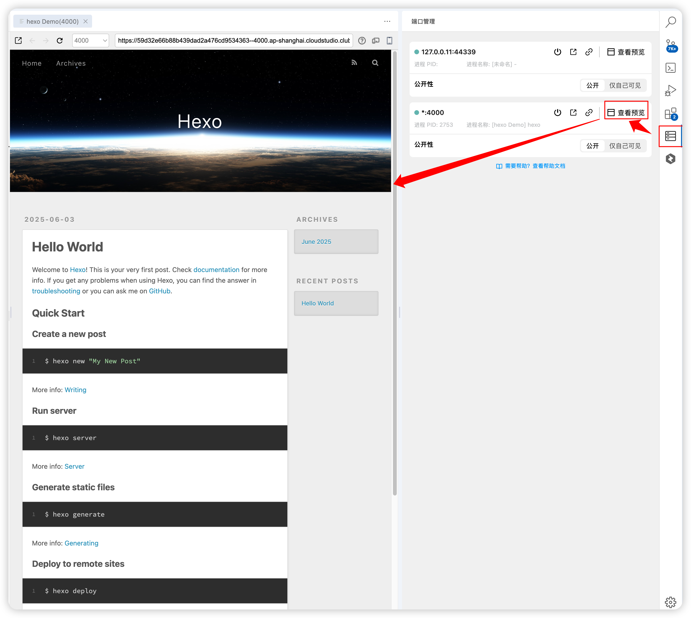

# 一、概述

Hexo 是一个快速、简洁且高效的博客框架。 Hexo 使用 [Markdown](http://daringfireball.net/projects/markdown/)（或其他标记语言）解析文章，在几秒内，即可利用靓丽的主题生成静态网页。

该项目为官方是入门示例，启动成功后将展示欢迎页。

**预装环境：** `node v18.13.0` `create-react-app`  `pnpm`  `yarn`  `node-gyp`  `git` 等。

注：npm & yarn默认配置了腾讯云仓库。

## 二、快速开始

### 启动
- 快速启动：你可以通过点击 JupyterLab 顶部的 **运行按钮** 快速启动。

    

- 手动启动：使用如下命令，快速运行一个 Hexo 程序：
    ```
    // 安装依赖包
    yarn install
    // 运行示例程序
    yarn run server
    ```

### 访问
1. 点击 Cloud Studio 右侧的 **【端口管理】** 按钮；
2. 找到端口 `4000`（开发服务器默认端口），点击对应的 **【查看预览】**；



### 三.  文件结构

```
workspace/
├── _config.landscape.yml        // 特定布局主题配置
├── _config.yml        // 主配置文件 
├── package.json             // 依赖包引用
├── README.md                // 项目说明文档
├── scaffolds        //模板文件夹。新建文章时，Hexo 会根据 scaffold 来建立文件
│   ├── draft.md
│   ├── page.md
│   └── post.md
├── source            //资源文件夹。 是存放用户资源的地方。
│   └── _posts
│       └── hello-world.md    // 初始欢迎页
├── themes            // 主题文件夹。 Hexo 会根据主题来生成静态页面。
│   └── .gitkeep   
└── yarn.lock
```

### 2.  Hexo 官方文档与资源

[文档 | Hexo](https://hexo.io/zh-cn/docs/index.html)

[故障排除 | Hexo](https://hexo.io/zh-cn/docs/troubleshooting.html)

[配置 | Hexo](https://hexo.io/zh-cn/docs/configuration)

[markdown 帮助文档](https://https://markdown.com.cn/basic-syntax/.com.cn/basic-syntax/)

[GitHub · hexo issues](https://github.com/hexojs/hexo/issues)

[npm官网](https://www.npmjs.com/)

[yarn官网](https://www.yarnpkg.cn/)

## 三、帮助和支持
### 1. Cloud Studio 相关支持
- [Cloud Studio 帮助文档](https://cloudstudio.net/docs/)

### 2. 用户反馈群
扫码加入 Cloud Studio 用户反馈群，获取实时技术支持：
- 腾讯云工程师群内答疑，解决环境与训练问题；
- 优先体验产品上新功能，获取专属活动通知；
- 与其他开发者交流 LoRA 训练经验与技巧。


使用：
新建文章
    npx hexo new "标题"
本地预览
    npx hexo s
发布：
    npx hexo d
