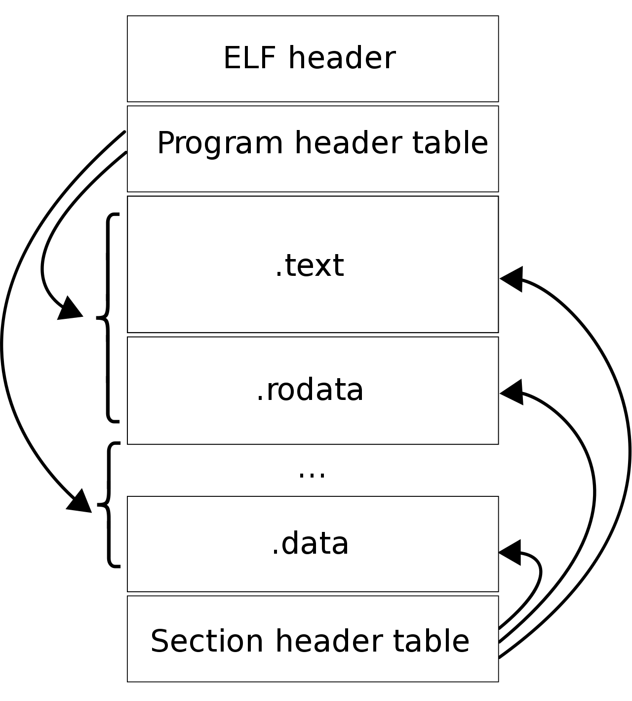
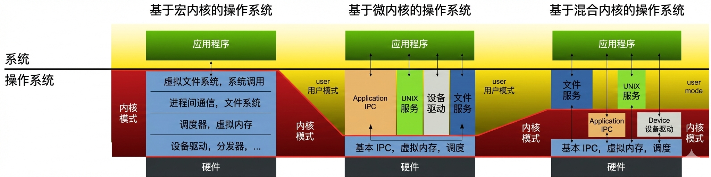

title: 学习笔记：内存管理
date: 2026-02-23 22:30:00
tags: [学习笔记,内存管理]
categories: 
    - 学习记录
    - 操作系统
---

资料来源：小林coding

# 内核

内核程序执⾏在内核态，⽤户程序执⾏在⽤户态。当应⽤程序使⽤系统调⽤时，会产⽣⼀个中断。发⽣中断后， CPU 中断当前在执⾏的⽤户程序，转⽽跳转到中断处理程序，也就是开始执⾏内核程序。内核处理完后，主动触发中断，把 CPU 执⾏权限交回给⽤户程序，回到⽤户态继续⼯作。

应用程序和用户程序在大多数语境下，是同一个东西。

应用程序： 侧重于功能。比如微信、浏览器、Word、简单的 Python 脚本。
用户程序： 侧重于身份和权限。它强调这个程序运行在“用户空间”，受限于“用户态”，没有直接操作硬件的特权。

# Linux内核

### 主要理念：
+ ***MutiTask，多任务***
对于单核 CPU ，可以让每个任务执⾏⼀⼩段时间，时间到就切换另外⼀个任务，从宏观⻆度看，⼀段时间内执⾏了多个任务，这被称为**并发**。
对于多核 CPU ，多个任务可以同时被不同核⼼的 CPU 同时执⾏，这被称为**并⾏**。
+ ***SMP，对称多处理***
对称代表每个 CPU 地位相等，对资源的使⽤权限也相同，多个 CPU共享同⼀个内存，每个 CPU 都可以访问完整的内存和硬件资源。这个特点决定了 Linux 操作系统不会有某个CPU单独服务应⽤程序或内核程序，⽽是每个程序都可以被分
配到任意⼀个 CPU 上被执⾏。
一个程序执行到一半，如果被中断了，下次恢复执行时，可能会被分配到CPU 核心上。
+ ***ELF，可执⾏⽂件链接格式***
ELF 的意思是可执⾏⽂件链接格式，它是 Linux 可执⾏⽂件的存储格式。

ELF 把⽂件分成了⼀个个分段，详见《程序员的⾃我修养——链接、装载和库》。
ELF文件的两种**索引**：Program header table 中记录了「运⾏时」所需的段，⽽ Section header table 记录了⼆进制⽂件中各个「段的⾸地址」。
ELF文件的**生成**：C/C++ 代码——编译器编译成汇编代码——汇编器变成⽬标代码——链接器把多个⽬标⽂件以及调⽤的各种函数库链接起来，形成⼀个可执⾏⽂件ELF文件。
ELF文件的**执行**：执⾏ ELF ⽂件的时候，会通过「装载器」把 ELF ⽂件装载到内存⾥，CPU 读取内存中的指令和数据，于是程序就被执⾏起来了。
+ ***Monolithic Kernel，宏内核***

### 名词解释
**System Call (系统调用)**：用户态与内核态之间的**唯一合法接口**。当应用程序需要特权操作（如读写文件、申请内存、创建进程）时，必须通过软中断（Software Interrupt）或特殊的陷入指令（Trap）触发系统调用。这会导致 CPU 的上下文切换（Context Switch），从用户态切换到内核态。
**VFS (Virtual File System, 虚拟文件系统) & File System (文件系统)**：VFS 是一个软件抽象层，它定义了一套通用的 API（如 open(), read(), write()）。无论底层是磁盘的 NTFS/EXT4，还是网络的 NFS，VFS 都能让应用程序以统一的方式操作它们。File System 则是具体负责在物理存储介质上组织数据块和目录结构的模块。
**Scheduler (调度器) & Dispatcher (分发器)**：负责 CPU 资源的时间多路复用。调度器运行特定的算法（如时间片轮转、完全公平调度 CFS）来决定“下一个该让哪个进程占用 CPU”。分发器则负责执行具体的上下文切换动作（保存当前进程的寄存器状态，加载新进程的状态）。
**IPC (Inter-Process Communication, 进程间通信)**：由于虚拟内存机制隔离了各个进程，进程之间不能直接读写对方的内存。IPC 提供了安全的跨进程数据交换机制，包括管道（Pipes）、消息队列（Message Queues）、共享内存（Shared Memory）和信号量（Semaphores）等。
**Device Driver (设备驱动)**：包含特定硬件设备（如网卡、显卡、硬盘控制器）的控制逻辑代码。它将操作系统通用的 I/O 请求翻译成硬件特定的寄存器读写指令或设备控制命令。
**宏内核**：特征是系统内核的所有模块，⽐如进程调度、内存管理、⽂件系统、设备驱动等，都运⾏在内核
态。Linux 内核架构就是宏内核，意味着 Linux 的内核是⼀个完整的可执⾏程序，且拥有最⾼的权限。
不过，Linux 也实现了动态加载内核模块的功能，例如⼤部分设备驱动是以可加载模块的形式存在的，与内核其他模块解藕，让驱动开发和驱动加载更为⽅便、灵活。
**微内核**：与宏内核相反，微内核架构的内核只保留最基本的能⼒，⽐如进程调度、虚拟机内存、中断等，把⼀些应⽤放到了⽤户空间，⽐如驱动程序、⽂件系统等。
优势：核内核功能少，可移植性⾼。服务与服务之间是隔离的，单个服务出现故障或者完全攻击，也不会导致整个操作系统挂掉，提⾼了操作系统的稳定性和可靠性。
缺点：由于驱动程序不在内核中，且驱动程序会频繁调⽤底层能⼒，于是驱动和硬件交互就需要频繁切换到内核态，带来性能损耗。
**混合类型内核**：架构有点像微内核，内核⾥⾯会有⼀个最⼩版本的内核，其他模块会在这个基础上搭建，实现的时候会跟宏内核类似，也就是把整个内核做成⼀个完整的程序，⼤部分服务都在内核中，这就像是宏内核的⽅式包裹着⼀个微内核。

# Windows 设计
今 Windows 7、Windows 10 使⽤的内核叫Windows NT

Windows 和 Linux ⼀样，⽀持 MutiTask 和 SMP，不同的是，Window 的内核设计是**混合型内核**。
### 名词解释
**环境子系统 (Environment Subsystems)**
+ Win32 / POSIX / OS/2 Application: 各种标准的应用程序。
+ Win32 / POSIX / OS/2 Subsystem: 翻译官。比如 Win32 子系统负责把软件的请求翻译成内核能听懂的语言。
**一体化子系统 (Integral Subsystems)**
+ Security (LSASS.exe) ：安全子系统，负责处理登录、权限验证。
+ Workstation Service：负责网络连接（比如访问共享文件夹）。
+ Server service: 让电脑能被别人访问（提供共享资源）。
**执行体服务 (Executive Services)**
内核的上层接口，包含一系列管理器：
+ I/O Manager: 管理输入输出，比如读写硬盘、网络收发。
+ Security Reference Monitor: 权限检查，每次访问文件时，它都检查是否有权执行。
+ IPC Manager: 负责进程间通信，让不同程序能安全通信。
+ Virtual Memory Manager (VMM): 虚拟内存管理器，给每个程序分配“假内存”，并负责与物理内存映射。
+ Process Manager: 负责创建、销毁进程和线程。
+ PnP Manager (Plug and Play): 即插即用管理器，例如插上 U 盘能自动识别。
+ Power Manager: 电源管理，负责休眠、待机、省电模式。
+ Window Manager & GDI: 图形界面管理器。负责画出窗口、字体和图标。
+ Object Manager: 对象管理器。在 Windows 眼里，文件、进程、设备都是“对象”，由它统一编号和管理。
**内核底层 (Core Kernel)**
+ Kernel mode drivers: 内核模式驱动。这些驱动权限极高，能直接操作内核数据。
+ Microkernel: 这里的“微内核”是指 Windows 的核心调度器，它负责最基础的 CPU 任务分配和中断处理。
+ HAL (Hardware Abstraction Layer): 硬件抽象层。把不同的 CPU、主板硬件差异屏蔽掉，给上层提供统一的接口。
### 可执行文件
Windows 的可执⾏⽂件的格式与 Linux 也不同，格式叫 PE，称为可移植执⾏⽂件，扩展名通常是 .exe 、 .dll 、 .sys 等。PE结构与 ELF 结构有⼀点相似。

## 总结
内核的架构⼀般有这三种类型：
1.宏内核，包含多个模块，整个内核像⼀个完整的程序；
2.微内核，有⼀个最⼩版本的内核，⼀些模块和服务则由⽤户态管理；
3.混合内核，是宏内核和微内核的结合体，内核中抽象出了微内核的概念，也就是内核中会有⼀个⼩型的内核，其他模块就在这个基础上搭建，整个内核是个完整的程序；

Linux 采用宏内核，Window 采⽤混合内核。
这两个操作系统的可执⾏⽂件格式也不⼀样， Linux 可执⾏⽂件格式叫作 ELF，Windows 可执⾏⽂件格式
叫作 PE。